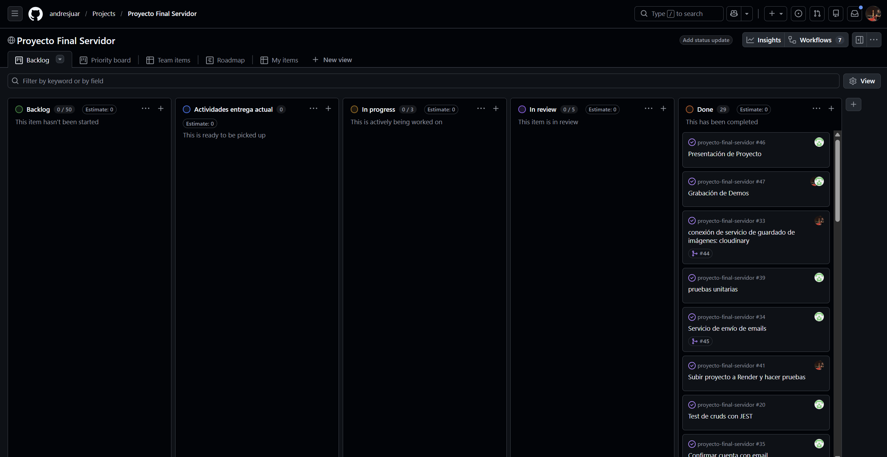

# Tablero de trabajo

En este enlace se encuentra el tablero de trabajo que vamos a utilizar en el desarrollo de este proyecto
Usaremos un kanban board manejando con github proyects

https://github.com/users/andresjuar/projects/1

## Nota de entrega Final

Una vez terminado el proyecto, llegamos a un total de 29 actividades divididas entre ambos o algunas realizadas por los dos. Hay tarjetas que están relacionadas con un pull request específico, ya que contiene el código de dicho requerimiento. 

